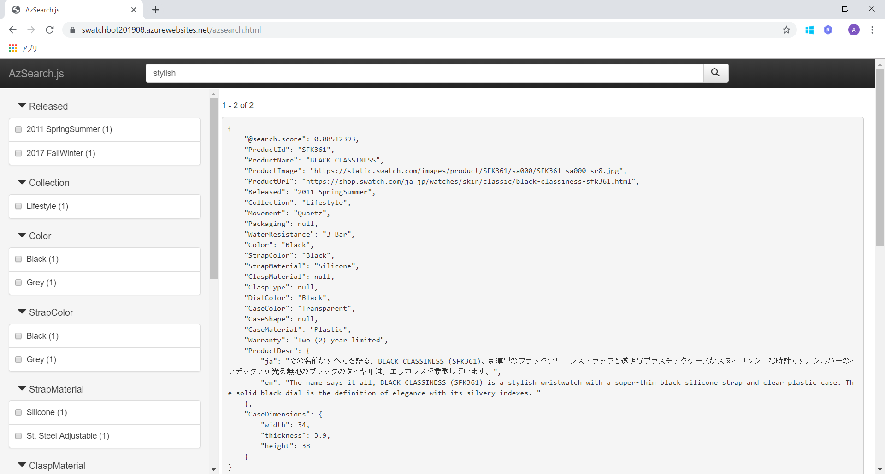
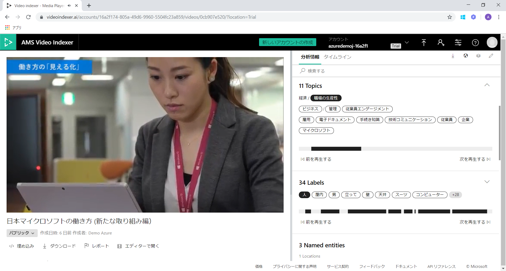
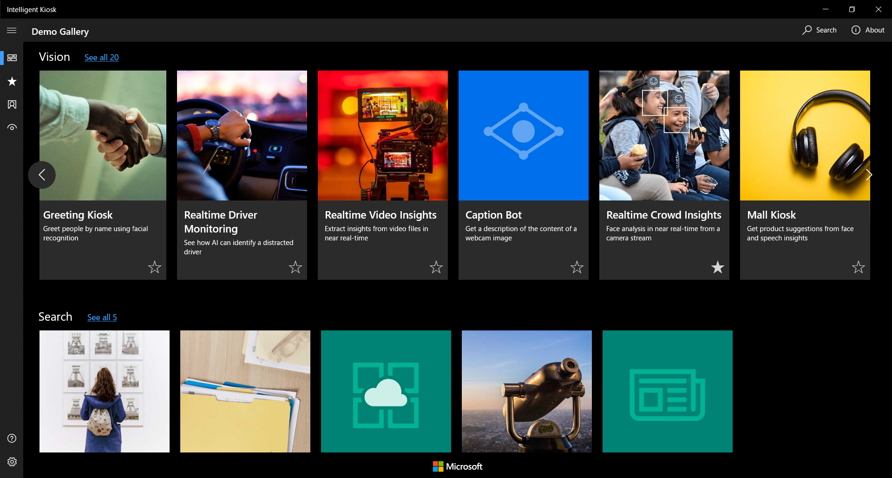

# Microsoft Japan Partner Conference 2019 : Microsoft Azure AI Demos

BS-D04「Microsoft Azure と AI で加速するデジタル改革」でご紹介した Microsoft Azure AI デモ集です。

### Search & Intelligent Bot

- Azure Search
  - [商品検索Botデモサイト](https://swatchbot201908.azurewebsites.net/home.html)
  - 
  - [商品検索デモサイト](https://swatchbot201908.azurewebsites.net/azsearch.html)
  - 

### 手書き認識

- Azure Cognitive Services - Ink Recognizer 
  - [手書き認識デモサイト](https://inkrecognizer201908.azurewebsites.net/)
  - [ソースコード](tree/master/inkrecognizer) (HTML/JavaScript)
  - 

### 音声認識(Speech to Text)、音声テキスト変換(Text to Speech)

- Azure Cognitive Services - Speech Service
  - [サンプルソースコード](https://github.com/ayako/CogServicesSpeechSamples_201907) (C#(.NET Core,UWP), HTML/JavaScript)
  - 
  - <video controls width="400px"><source src="AzureCognitiveSpeechToText_201907.mp4"></video>

### 動画分析

- Azure Media Service - Video Indexer
  - [Video Indexer Webサイト](https://vi.microsoft.com/ja-jp/)
  - 
  
### Intelligent Kiosk

- [Intelligent Kiosk](https://www.microsoft.com/ja-jp/p/intelligent-kiosk/9nblggh5qd84) (Windows Store アプリ) インストール
- 
